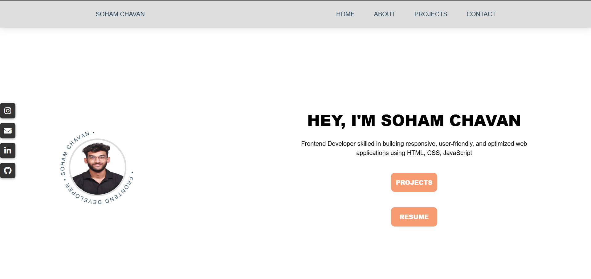
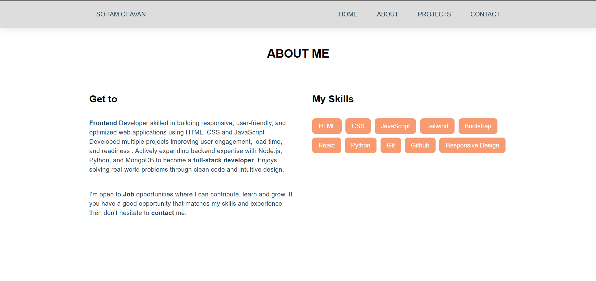
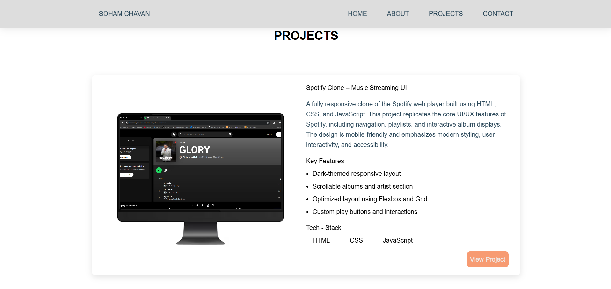
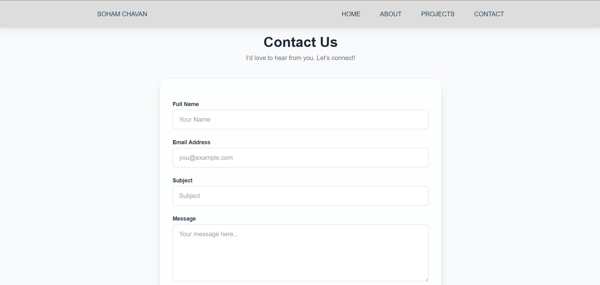

# 💼 Portfolio

Welcome to my personal portfolio website! This project showcases my skills, projects, and experiences as a frontend developer. It is designed to reflect my passion for web development, clean UI/UX, and continuous learning.

🔗 **Live Site:** [portfolio-soham-chavans-projects.vercel.app](https://portfolio-soham-chavans-projects.vercel.app/)

---

## 📌 Features

- Responsive design across all screen sizes
- Projects section with live previews and GitHub links
- About section highlighting my journey and skills
- Contact form with email integration
- Smooth scroll and elegant animations
- Deployed using **Vercel**

---

## 🛠 Tech Stack

- **Frontend:** HTML5, CSS3, JavaScript (ES6+)
- **Styling:** Tailwind CSS &  CSS Modules
- **Hosting:** Vercel

---

## 📷 Screenshots

## 🖼 Demo

